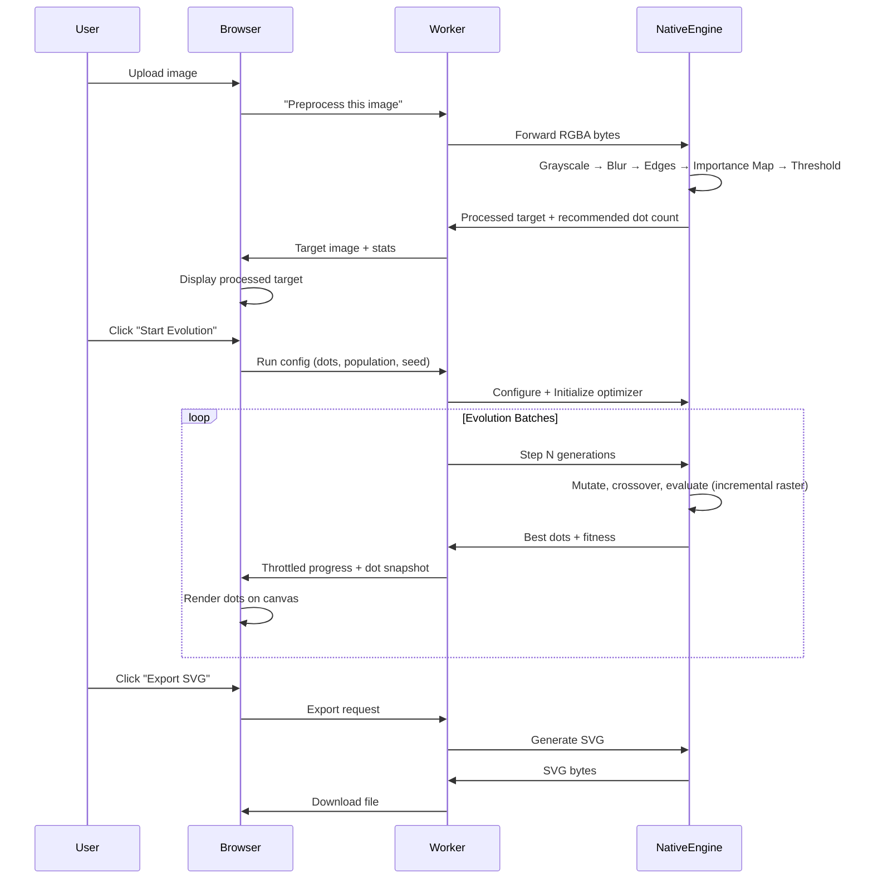
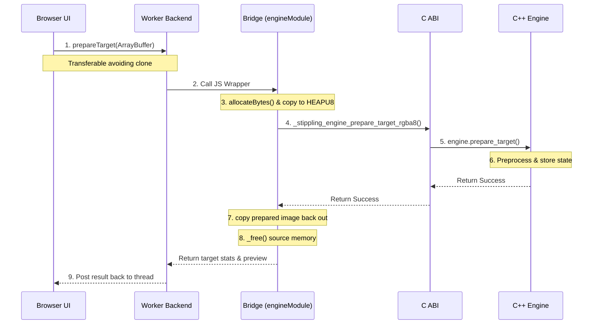

# Image to stippling art

This is a website that takes in an image and converts it into stippling art using a genetic algorithm. I initially built this project for my Applied AI class a few semesters ago — it was written in TypeScript then, and it was _very_ slow. I've been using a lot of C++ lately, and I wanted to make this faster with my newfound C++ powers. The computational core now compiles to WebAssembly for the browser and runs natively through a CLI.

This README is a detailed explanation of how it was built. Hope you enjoy it!

## What is stippling?

Stippling is an artistic technique where images are created entirely from small dots. Instead of using lines or continuous shading, the artist places individual dots — varying their density and spacing to create the illusion of tone, depth, and form. Areas with more tightly packed dots appear darker, while sparser regions read as lighter. It's a technique traditionally done by hand with pen and ink, and it takes a _lot_ of patience.

This project automates that process using a genetic algorithm — letting the computer figure out where to place thousands of dots to best reproduce a source image.

## What is a genetic algorithm?

A genetic algorithm (GA) is an optimization technique inspired by natural selection. The idea is simple: start with a population of random "candidates," evaluate how good each one is (its _fitness_), then let the best ones survive and reproduce — mixing traits through _crossover_ and introducing small random changes through _mutation_. Over many generations, the population converges toward better and better solutions.

Here's the cycle:

1. **Initialize** — generate a random population of candidate solutions
2. **Evaluate** — score each candidate against the objective (fitness function)
3. **Select** — pick the best-performing candidates as parents
4. **Crossover** — combine traits from two parents to create offspring
5. **Mutate** — introduce small random changes for exploration
6. **Repeat** — the next generation replaces the old, and the cycle continues

GAs are used all over the place in real-world applications:

- **Engineering design** — optimizing aerodynamic shapes, antenna configurations, and structural layouts
- **Logistics & scheduling** — solving vehicle routing, timetabling, and resource allocation problems
- **Finance** — portfolio optimization and trading strategy discovery
- **Bioinformatics** — protein folding, gene sequence alignment, and drug design
- **Game AI** — evolving behaviors and strategies for non-player characters
- **Machine learning** — hyperparameter tuning and neural architecture search

In this project, each "candidate" is a set of dot positions and sizes. The fitness function measures how closely the dots reproduce the target image. Over hundreds of generations, the dots migrate toward an arrangement that looks like the original photo — rendered entirely in stipple art.

So why use a genetic algorithm here instead of, say, gradient descent or a neural network? A genetic algorithm is a good fit here because the optimization landscape is rugged, high-dimensional, and only awkwardly differentiable under the project’s rasterized, thresholded dot representation. Each candidate is easy to score, but small changes in dot positions, sizes, and overlaps can produce discontinuous changes in image error, which makes straightforward gradient-based optimization less natural. A GA avoids that by searching through mutation, recombination, and selection rather than relying on derivatives. That said, gradient-based methods could work with a differentiable rendering formulation, and neural networks would be more useful as learned initializers or proposal models than as direct replacements for the optimizer. I was genuinely fascinated when I first learned about genetic algorithms in class — the idea that you could evolve a solution the same way nature evolves organisms felt almost too elegant. This project was my excuse to actually build something with the technique.

## The flow

## Steps

### 1. Preprocessing

Before any optimization happens, the input image needs to be transformed into something the optimizer can work with. The whole pipeline runs inside [`prepare_target()`](./cpp/engine/src/engine.cpp#L556-L590) in `engine.cpp`.

**Grayscale** — the engine first turns the image into a simple brightness map using the standard luminance formula (`0.299R + 0.587G + 0.114B`), so every pixel becomes just "how light or dark is this?" See [`extract_grayscale_channel()`](./cpp/engine/src/engine.cpp#L67-L86).

**Blur** — it softly smooths the image with a separable Gaussian pass so tiny specks and noise matter less. This helps the optimizer focus on the big shapes first instead of chasing every pixel. The blur amount is user-configurable via a slider. See [`apply_separable_blur()`](./cpp/engine/src/engine.cpp#L117-L155).

**Edges** — it finds places where brightness changes quickly in the _blurred_ image (not the raw original), like outlines, borders, and sharp facial features. Those are spots where dots usually matter more. This uses a Sobel filter computing horizontal and vertical gradients. See [`compute_edge_response()`](./cpp/engine/src/engine.cpp#L157-L186).

**Local Structure** — it compares the original grayscale image to the blurred one to see what fine detail got smoothed away. That highlights texture, hair, fabric, and other small local variation. See [`compute_local_structure()`](./cpp/engine/src/engine.cpp#L188-L198).

**Importance Map** — it combines darkness, edges, and texture into one "where should dots matter most?" map, weighted at 55% darkness, 30% edge energy, and 15% local structure. Dark regions matter, but sharp edges and fine detail get extra weight so the image doesn't turn into just blobs. A small darkness floor ensures broad shadows don't vanish when edge energy is low. Note that the darkness term here is based on the _blurred_ grayscale values, not the raw original. See [`combine_importance()`](./cpp/engine/src/engine.cpp#L200-L223).

**Quantize and Threshold** — the blurred image is rounded into byte values ([`quantize_channel()`](./cpp/engine/src/engine.cpp#L225-L231)) so the optimizer has a stable grayscale target to compare against. Then a separate black/white version is created via [`threshold_channel()`](./cpp/engine/src/engine.cpp#L233-L243) for display and statistics, so the UI can show a clean processed target and estimate how many dots are reasonable.

**Target Stats** — the engine counts how much of the image is dark and how much total importance exists, then uses that to suggest a dot count. The recommendation balances importance mass as the primary demand signal, a global area cap so dark images don't explode the workload, and a small black-pixel floor so sparse silhouettes still get enough dots. See [`calculate_target_stats()`](./cpp/engine/src/engine.cpp#L277-L313).

### 2. Multiscale Search

Instead of trying to place thousands of dots correctly on the full image from the start, the engine first learns the big shape cheaply, then keeps refining it as the image gets larger. This is called **multiscale optimization**, and it works through a "pyramid" — which is just the same image prepared at several sizes, from tiny to full size.

The pyramid is built from `optimizer_target_`, which is the quantized blurred grayscale target — not the thresholded black/white preview image. Each level stores a downsampled copy of both the target and the importance map. The whole pyramid is constructed inside [`initialize_optimizer()`](./cpp/engine/src/engine.cpp#L598-L649) using a fixed scale schedule:

| Level | Scale | What it learns                                                     |
| ----- | ----- | ------------------------------------------------------------------ |
| 1     | 1/8×  | Where the mass goes — broad silhouette and major dark regions      |
| 2     | 1/4×  | Regional structure and weight distribution                         |
| 3     | 1/2×  | Local corrections, medium detail                                   |
| 4     | 1×    | Where the details go — fine edges, small features, final precision |

Each level's target and importance map are downsampled using area averaging ([`resample_u8_average()`](./cpp/engine/src/engine.cpp#L340-L395) and [`resample_double_average()`](./cpp/engine/src/engine.cpp#L403-L449)) rather than point sampling, which preserves coverage mass and prevents thin structures from getting aliased away at coarse scales.

**Dot budget scaling** — coarse levels don't need the full dot count. The engine scales the budget by `sqrt(level_area / full_area)` inside [`initialize_level_optimizer()`](./cpp/engine/src/engine.cpp#L651-L685). At 1/8× width and 1/8× height, the area is 1/64th of full resolution, so the dot count becomes roughly 1/8th of the full budget. Coarse levels should be cheap and structural, not fully detailed.

**Promotion** — after each evolution batch, [`maybe_promote_level()`](./cpp/engine/src/engine.cpp#L687-L723) checks whether the current level is ready to move on. Promotion requires both a minimum generation count and the optimizer itself reporting readiness. When it fires, the best dots are scaled into the next level's coordinate space via [`scale_dots_between_spaces()`](./cpp/engine/src/engine.cpp#L455-L483), a brand new `Optimizer` is created for the finer level seeded with those projected dots, and diversity is rebuilt around them. The engine replaces the optimizer instance entirely on promotion — it's not the same optimizer continuing, it's a fresh one with a strong head start.

**Full-resolution projection** — callers (the browser UI, CLI, export) always receive dots in original image coordinates, regardless of which pyramid level is active. [`best_dots()`](./cpp/engine/src/engine.cpp#L742-L757) handles this transparently: if the optimizer is still on a coarse level, it projects the dots upward via [`project_dots_to_image_space()`](./cpp/engine/src/engine.cpp#L777-L783) so previews just work without knowing about pyramid internals.

### 3. Hybrid Evolutionary Optimization

At each pyramid level, a population of candidate dot arrangements evolves inside [`optimizer.cpp`](./cpp/engine/src/optimizer.cpp). The evolution loop runs in [`evolve_batch()`](./cpp/engine/src/optimizer.cpp#L171-L210), and each generation follows this order: preserve elites → refine elites → breed children → migrate islands → update stagnation → maybe restart.

**Initialization** — when the population is first created in [`initialize_population()`](./cpp/engine/src/optimizer.cpp#L329-L361), dots are not placed randomly. 90% are placed via [`guided_dot()`](./cpp/engine/src/optimizer.cpp#L665-L690), which samples from a precomputed weighted distribution built in [`build_target_sampler()`](./cpp/engine/src/optimizer.cpp#L310-L326). That sampler mixes 65% darkness with 35% importance — so dark regions still dominate placement, but edges and texture pull extra dots toward them. The remaining 10% of dots are fully random for exploration. When seed dots exist from a coarser level, the first candidate preserves them exactly, while the rest of the population fans out around those seeds with jitter via `local_search_dot()`.

**Fitness** — each candidate stores its own dots, its own persistent `RasterGrid`, a `squared_error`, and a `fitness` score. The optimizer works against `target_`, which is the prepared grayscale target bytes — not the thresholded black/white preview. Fitness is computed in [`update_candidate_fitness()`](./cpp/engine/src/optimizer.cpp#L384-L390) as `sqrt(1 - squared_error / max_possible_error)`, where the square root softens the scale so progress is easier to interpret. Deterministic tie-breaking in [`candidate_better()`](./cpp/engine/src/optimizer.cpp#L40-L72) falls through to comparing dot coordinates lexicographically, ensuring native and WASM always select the same champion.

**Elite preservation** — [`evolve_batch()`](./cpp/engine/src/optimizer.cpp#L171-L210) first computes `elite_count` from `config_.elitism_ratio`, then [`preserve_elites()`](./cpp/engine/src/optimizer.cpp#L466-L476) sorts the population and keeps the top `elite_count` candidates. The top 3 elites then get extra local hill-climbing passes via [`refine_elites()`](./cpp/engine/src/optimizer.cpp#L478-L487), which calls [`refine_candidate()`](./cpp/engine/src/optimizer.cpp#L766-L813). Refinement finds weak dots (low target score), proposes replacements, and accepts them if the raster error decreases _or_ if the replacement dot's target score is meaningfully better (> 1.05× the current dot's score) — it's not strictly greedy.

**Parent selection — island-aware tournaments** — the population is partitioned into islands (2 for populations ≥ 16, 4 for ≥ 48) via [`island_count_for_population()`](./cpp/engine/src/optimizer.cpp#L83-L90). [`select_parent()`](./cpp/engine/src/optimizer.cpp#L562-L597) runs tournament selection of size 4. Most samples stay within one island, but as stagnation rises, the probability of sampling globally increases (`0.12 + min(0.1, stagnation × 0.01)`) — letting successful structures spread without collapsing diversity too fast.

**Crossover — spatially aware** — [`make_child()`](./cpp/engine/src/optimizer.cpp#L493-L556) starts from the fitter parent as a clone, then attempts to import dots from the secondary parent. For each attempt it: (1) picks a random dot from the secondary parent, (2) optionally blends it with an anchor from the primary parent (40% chance) by averaging positions and radii, or applies a small local perturbation, (3) finds a replacement slot in the child via [`find_replacement_index()`](./cpp/engine/src/optimizer.cpp#L735-L764), which first looks for overlapping dots, then falls back to a nearby weak dot (only sampling 16 candidates, not all dots), (4) evaluates the swap via `apply_dot_delta_and_update_error()` — which mutates the raster in-place to compute the hypothetical next error. Acceptance isn't strictly "did error decrease" — it can also accept if the proposal's target score is meaningfully better, or with a small stagnation-dependent exploratory probability. Rejected proposals must be explicitly reverted to keep raster state in sync.

**Mutation — adaptive** — [`mutate()`](./cpp/engine/src/optimizer.cpp#L819-L864) iterates all dots. Both the mutation rate ([`adaptive_mutation_rate()`](./cpp/engine/src/optimizer.cpp#L647-L651)) and the motion distance ([`mutation_distance_scale()`](./cpp/engine/src/optimizer.cpp#L653-L656)) increase with stagnation. Three mutation modes compete: 55% local search around the current dot, 30% reseed from the guided sampler (darkness + importance weighted), and 15% fully random. Like crossover, acceptance can be exploratory — there's a stagnation-dependent probability of accepting a mutation even if error increased. This lets the same codepath handle both refinement and exploration without hard-coding separate phases.

**Island migration** — [`migrate_islands()`](./cpp/engine/src/optimizer.cpp#L599-L637) runs every 4 generations. Each island's champion replaces the weakest member of the next island in a deterministic ring rotation — cheap, deterministic, and enough to share breakthroughs without homogenizing the whole population.

**Partial restarts** — [`apply_restart_strategy_if_needed()`](./cpp/engine/src/optimizer.cpp#L415-L464) fires after sustained stagnation: 8 generations if the level is narrow (`width_ < 96`), 10 otherwise. It replaces the weakest ~20% of the population with new candidates that use up to 25% of the champion's dots as a starting point — but those dots are _perturbed_ through `local_search_dot()`, not copied verbatim. The rest of each replacement candidate is filled from guided and random proposals. The stagnation counter is halved (not reset to zero), so repeated stagnation can trigger further restarts. This lets the search escape a fitness basin without discarding everything it has learned.

### 4. Incremental Raster Fitness

This is the biggest performance win in the entire project, and it all lives in [`raster_grid.cpp`](./cpp/engine/src/raster_grid.cpp).

The original TypeScript version evaluated fitness by re-rendering every candidate from scratch on every generation — painting all dots onto a blank grid, then comparing pixel-by-pixel against the target. That scales linearly with both dot count and image size per evaluation, and it made the old prototype very slow.

The C++ engine takes a completely different approach. Each candidate in the population owns a persistent [`RasterGrid`](./cpp/engine/src/raster_grid.cpp#L18-L26), which stores two parallel arrays: a binary rendered image (`pixels_` — 255 for white, 0 for black) and a per-pixel coverage count (`coverage_` — how many dots currently cover each pixel). Dots are rasterized as filled circles by generating circle extents with a midpoint-circle style integer stepping loop in [`draw_circle()`](./cpp/engine/src/raster_grid.cpp#L103-L134) and then filling horizontal spans through [`update_horizontal_span()`](./cpp/engine/src/raster_grid.cpp#L136-L167). A `delta` parameter controls whether a dot is being added (`+1`) or removed (`-1`).

**Why coverage counts matter** — when two dots overlap and you erase one, the overlapping pixels should stay black because the other dot still covers them. The coverage count tracks exactly how many dots cover each pixel. A pixel is black if `coverage > 0`, white if `coverage == 0`. Without this, erasing one dot would incorrectly whiten pixels that another dot still owns.

**Incremental error updates** — when the optimizer wants to try moving a dot, it calls [`apply_dot_delta_and_update_error()`](./cpp/engine/src/raster_grid.cpp#L46-L58), which performs two sequential incremental passes: first erase the old dot, then draw the new dot. During each pass, `update_horizontal_span()` checks whether each affected pixel actually _changed_ value (line 159) — and only then subtracts the old pixel's squared error contribution and adds the new one. The running `squared_error` is updated in-place as the raster changes, so by the time both passes finish, the caller has the exact error the candidate would have if the swap were committed.

**Reversible but not automatic** — the raster is mutated in-place to compute these deltas. If the optimizer decides to reject the proposal, it must explicitly call the function _again_ with the dots swapped back. If any codepath forgets to revert, the raster and error silently drift out of sync. That's why the optimizer has a separate [`validate_incremental_state()`](./cpp/engine/src/optimizer.cpp#L228-L289) function and a [`squared_error()`](./cpp/engine/src/raster_grid.cpp#L60-L74) full-redraw path — so tests and CLI commands can prove the incremental bookkeeping hasn't drifted from the reference raster.

This design makes every mutation, crossover, and refinement operation dramatically cheaper. Instead of re-rendering all dots and comparing all pixels, each proposal only touches the pixels under the two dots involved — turning fitness evaluation from O(dots × pixels) to O(dot_footprint).

### 5. Export

Once you're satisfied with the result, the engine can export:

- **SVG** — clean vector output, scalable to any resolution
- **PNG** — rasterized output with a hand-written encoder (dependency-free, deterministic)
- **Timelapse SVG** — an animated SVG showing how the dots evolved over time, assembled from frame snapshots captured during the run

## The C++ ↔ TypeScript Bridge (WASM)

The bridge is the layer that lets browser TypeScript call the native C++ engine compiled to WebAssembly, without the UI needing to know anything about C++ pointers or WASM memory. That architecture is one of the strongest engineering parts of the project.

### High-Level Flow

1. Browser UI talks to the worker client in [`WasmEngineClient.ts`](./src/wasm/WasmEngineClient.ts)
2. The worker in [`gaWorker.ts`](./src/worker/gaWorker.ts) talks to [`WasmEngineBackend.ts`](./src/worker/WasmEngineBackend.ts)
3. That backend talks to the WASM wrapper in [`engineModule.ts`](./src/wasm/engineModule.ts)
4. The WASM wrapper calls exported C functions from [`c_api.cpp`](./cpp/engine/src/c_api.cpp) / [`c_api.h`](./cpp/engine/include/stippling/engine/c_api.h)
5. Those C functions forward into the real C++ engine

### Why a C API?

C++ classes do not cross the JS/WASM boundary cleanly. Name mangling, exceptions, object layout, and ownership rules would make that fragile. So the project exposes a plain C surface in `c_api.h` with functions like `create/destroy engine`, `prepare target`, `configure optimizer`, `evolve batch`, `copy prepared image`, and `copy best dots`.

That gives the TypeScript side a predictable ABI using simple primitives: integers, doubles, pointers, byte buffers, and plain structs.

### How the Bridge Works

`engineModule.ts` is the real bridge layer. Its job is to:

- load the generated Emscripten module
- create a native engine handle with `_stippling_engine_create()`
- allocate WASM memory with `_malloc()`
- copy JS bytes into `HEAPU8`
- call exported C functions
- copy results back out of `HEAPU8`
- free temporary allocations with `_free()`
- translate native failures into JS Errors using `_stippling_engine_last_error()`

Every bridge operation follows the exact same pattern:

1. allocate memory in WASM
2. write input bytes into WASM heap
3. call native C function
4. read output bytes/values back
5. free temporary memory

**Dot Struct Decoding:**
The best-dot snapshot comes back as a flat native array of structs. The bridge knows each dot is 3 doubles (x, y, radius), so it manually decodes the native struct layout directly out of raw WASM memory using `DOT_STRIDE_BYTES = 24` and `DataView.getFloat64(..., true)`.

### Walkthrough: `prepareTarget()`

`prepareTarget()` is the cleanest example because it goes from browser pixels all the way into native preprocessing and then back out as a prepared preview image plus stats.

1. **UI calls `prepareTarget()`**: The UI reads current image pixels from the canvas, builds a config, and calls `engineClient.prepareTarget(...)`. It sends the image ArrayBuffer as a transferable to avoid an expensive structured-clone copy.
2. **Worker backend calls bridge**: The worker receives the command and tells the WASM backend to call the bridge in `engineModule.ts`.
3. **JS allocates WASM memory**: `engineModule` wraps the pixels in a `Uint8Array`, allocates native memory with `allocateBytes()`, and copies the JS bytes into `module.HEAPU8`. The pixel bytes are now physically inside WASM memory.
4. **JS calls exported C function**: It calls `_stippling_engine_prepare_target_rgba8(...)` with the raw pixel pointer and config options.
5. **C ABI forwards to C++**: The C ABI catches exceptions, packages the raw pointers into C structures, and forwards them to `engine.prepare_target(...)`.
6. **Native engine preprocesses**: The engine runs the full preprocessing pipeline (grayscale, blur, edges, importance map, thresholding) and stores the `optimizer_target_` and `importance_map_`.
7. **JS reads results back**: After the C call succeeds, `engineModule` reads target stats with C getter functions. It then allocates an output buffer in WASM, calls `_stippling_engine_copy_prepared_image_rgba8(...)`, and copies the processed black/white preview image _back out_ into a new JS `Uint8ClampedArray`.
8. **Memory is freed**: The temporary source pixel pointer allocated at the start is freed. This manual memory management prevents the WASM heap from leaking on repeated image processing.
9. **Worker replies to UI**: The backend wraps the result in an event and posts it back to the main thread.

**Key takeaway:** `prepareTarget()` copies bytes twice across the boundary (JS → WASM for input pixels, WASM → JS for the preview image). It is critical to note that the browser gets the _thresholded RGBA preview_, while the optimizer internally keeps the _quantized blurred grayscale_ and importance map.

### Web Workers and Emscripten

Even though the heavy compute is in C++, the calls still happen from JavaScript. If you run that on the main thread, the browser still stutters. By putting the WASM bridge in a dedicated worker (in `gaWorker.ts`), the project achieves native compute performance with off-main-thread scheduling and a responsive UI.

**Where is the `.wasm` file?**
There is no separate `.wasm` file. Emscripten compiles the C++ codebase (driven by `build-wasm.sh` and CMake) and generates `stipplingEngine.js`. Because the build uses `-sSINGLE_FILE=1 -sMODULARIZE=1 -sEXPORT_ES6=1`, the WASM bytes are embedded directly inside that single ES6 module. Emscripten provides the runtime, exported C symbols, `HEAPU8` views, and `_malloc`/`_free`.

### Tradeoffs

**Pros:**

- The native engine is shared exactly by the browser and CLI.
- The ABI is explicit and testable.
- Parity testing runs exactly the same C++ logic against native binaries and WASM.
- The UI stays decoupled from engine internals.

**Cons:**

- Manual memory management in TypeScript.
- Raw pointers and copied buffers are easy places for bugs.
- Data crossing the boundary is not free.
- Complex structs need manual packing/unpacking.

Because of the boundary cost, the bridge keeps calls coarse-grained (e.g., prepare a _whole image_, evolve a _whole batch_, copy a _whole snapshot_) instead of constantly pinging the engine for tiny operations.

## Benchmarks

Once the native engine existed, the obvious question was whether all of this extra architecture actually mattered. The benchmark harness in [`scripts/benchmark-headless.ts`](./scripts/benchmark-headless.ts) answers that by comparing two versions of the project under the same conditions:

- the **archived TypeScript implementation**, which represents the original prototype
- the **active C++/WASM engine**, which is the worker-hosted native runtime used by the browser today

What gets benchmarked is not just "how many generations can each version execute?" but also "how quickly can each version reach the same quality target?" That distinction matters. Raw throughput is useful, but a fast engine that converges poorly is not very interesting. So the harness records both:

- **throughput** in generations per second
- **time to a shared quality target**, using the same seed and configuration
- **final output quality**, using `MSE`, `RMSE`, `PSNR`, and exact pixel ratio

To keep the comparison honest, both paths use the same preprocessing setup (`blur = 0`, `threshold = 130`), the same default optimizer settings (`population = 100`, `mutation = 0.2`, `elitism = 0.15`), the same fixed seed (`1337`), a warmup pass before measurement, and five repeated runs summarized by median values. The "time to quality" target is chosen as the lower of the two warmup final fitness values, so both backends are judged against the same bar rather than against separate end states.

The main performance harness is exposed through `npm run benchmark`.

### Latest Results

The latest local benchmark report is measured on the two real-image fixtures in the project root:

| Image            | Size      | Dot Count | Archived TS    | WASM            | Throughput Speedup | Time to Same Quality                    |
| ---------------- | --------- | --------- | -------------- | --------------- | ------------------ | --------------------------------------- |
| `jobs.jpeg`      | `210x240` | `407`     | `115.21 gen/s` | `2582.45 gen/s` | `22.41x`           | `78.2 ms` → `0.2 ms` (`99.7%` faster)   |
| `landscape.avif` | `740x493` | `4006`    | `4.57 gen/s`   | `294.36 gen/s`  | `64.36x`           | `1963.1 ms` → `3.6 ms` (`99.8%` faster) |

The portrait image already shows a large win: the WASM path is roughly **22x faster** in raw optimization throughput and reaches the same quality target essentially immediately compared to the archived TypeScript path. The larger landscape image is the more meaningful stress test, and that is where the architectural changes really show up: the worker-hosted C++/WASM engine is roughly **64x faster** in throughput and reaches the same target fitness in about **0.2% of the time**.

### Quality Metrics From That Run

The benchmark also records final output quality for each backend:

| Image            | Backend     | Final Fitness | MSE        | RMSE     | PSNR   | Exact Pixel Ratio |
| ---------------- | ----------- | ------------- | ---------- | -------- | ------ | ----------------- |
| `jobs.jpeg`      | Archived TS | `0.7859`      | `24859.16` | `157.67` | `4.18` | `0.6177`          |
| `jobs.jpeg`      | WASM        | `0.8605`      | `25270.73` | `158.97` | `4.10` | `0.6114`          |
| `landscape.avif` | Archived TS | `0.6491`      | `37625.99` | `193.97` | `2.38` | `0.4214`          |
| `landscape.avif` | WASM        | `0.7651`      | `38253.74` | `195.59` | `2.30` | `0.4117`          |

These quality numbers are most useful when read alongside the time-to-quality numbers. The point of this benchmark is not "which backend looks better after the exact same fixed number of generations?" The point is "how much faster can the native engine reach a comparable level of solution quality?" On that measure, the C++/WASM path is decisively ahead.

## Conclusion

This started as a final project for my Applied AI class and turned into something more involved than expected: a shared C++ core, a C ABI, a WebAssembly bridge, a worker-hosted runtime, a CLI, export tooling, and reproducible benchmarks; all sharing the same optimization logic.

The performance gains came from a stack of changes rather than any single fix: incremental raster fitness, multiscale search, adaptive mutation, and moving the compute off the main thread. Measuring each one honestly was as important as building it.

All in all, very fun to build. This is also also my first real use of WASM, and the boundary between native and browser code turned out to be one of the more interesting design problems in the project.
